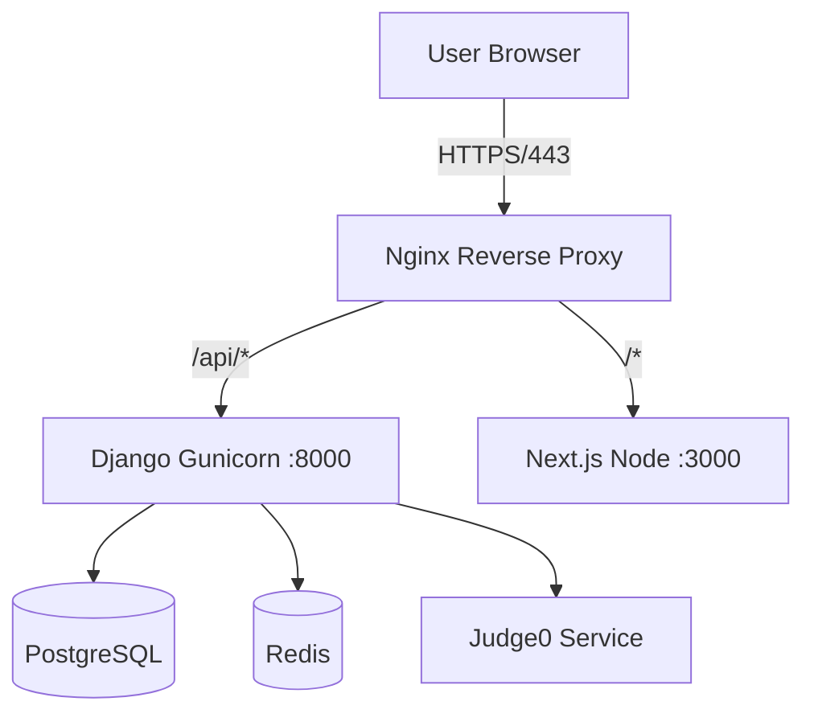

# Production Deployment Guide

This guide outlines the steps to deploy the Multi-Tenant LMS to a production environment (e.g., AWS EC2, DigitalOcean Droplet, or generic Linux VPS).

## 1. Architecture Overview



## 2. Prerequisites

- Linux Server (Ubuntu 22.04 LTS recommended)
- Docker & Docker Compose installed
- Domain Name (A records pointing to server IP)

## 3. Environment Setup

Create a `.env.prod` file on the server (do not commit to git):

```bash
# Django
DJANGO_SECRET_KEY=super-secure-random-string
DEBUG=False
ALLOWED_HOSTS=.yourdomain.com
DATABASE_URL=postgres://lms_user:secure_pass@db:5432/lms
REDIS_URL=redis://redis:6379/1

# Postgres
POSTGRES_DB=lms
POSTGRES_USER=lms_user
POSTGRES_PASSWORD=secure_pass

# Frontend
NEXT_PUBLIC_API_URL=https://yourdomain.com/api

# AI Service
GEMINI_API_KEY=your_gemini_api_key_here
```

## 4. Nginx Configuration (Reverse Proxy)

Install Nginx (`apt install nginx`). Create `/etc/nginx/sites-available/lms`:

```nginx
server {
    server_name yourdomain.com;

    location / {
        proxy_pass http://localhost:3000;
        proxy_set_header Host $host;
        proxy_set_header X-Real-IP $remote_addr;
        proxy_set_header X-Forwarded-For $proxy_add_x_forwarded_for;
        proxy_set_header X-Forwarded-Proto $scheme;
    }

    location /api {
        proxy_pass http://localhost:8000;
        proxy_set_header Host $host;
        proxy_set_header X-Real-IP $remote_addr;
    }

    location /static/ {
        alias /var/www/lms/static/;
    }

    location /media/ {
        alias /var/www/lms/media/;
    }
}
```

Enable SSL with Certbot:
```bash
sudo apt install certbot python3-certbot-nginx
sudo certbot --nginx -d yourdomain.com
```

## 5. Docker Deployment

Update `docker-compose.prod.yml` to strip out development bindings and use the env file.

```bash
docker-compose -f docker-compose.yml up -d --build
```

## 6. Maintenance & Backups

### Database Backup (Cronjob)
Create a script `backup_db.sh`:
```bash
#!/bin/bash
docker exec lms_db_1 pg_dump -U lms_user lms > /backups/lms_$(date +%F).sql
# Sync to S3 bucket here...
```

Add to Crontab:
```bash
0 2 * * * /path/to/backup_db.sh
```

## 7. Monitoring & Logging

- **Logs**: Use `docker logs -f lms_backend_1` for realtime debugging.
- **Audit Logs**: Stored in `core_auditlog` table. Query via Django Admin.
- **Uptime**: Use a service like UptimeRobot to ping `https://yourdomain.com/api/health`.

## 8. Security Checklist

- [ ] **Firewall**: Allow only 22 (SSH), 80 (HTTP), 443 (HTTPS). Block 8000/3000/5432/6379 externally.
- [ ] **Rate Limiting**: Enabled in Django (`DEFAULT_THROTTLE_RATES`).
- [ ] **File Uploads**: Validation logic checks for malicious extensions (.exe, .php).
- [ ] **Secrets**: Never commit `.env` files.
